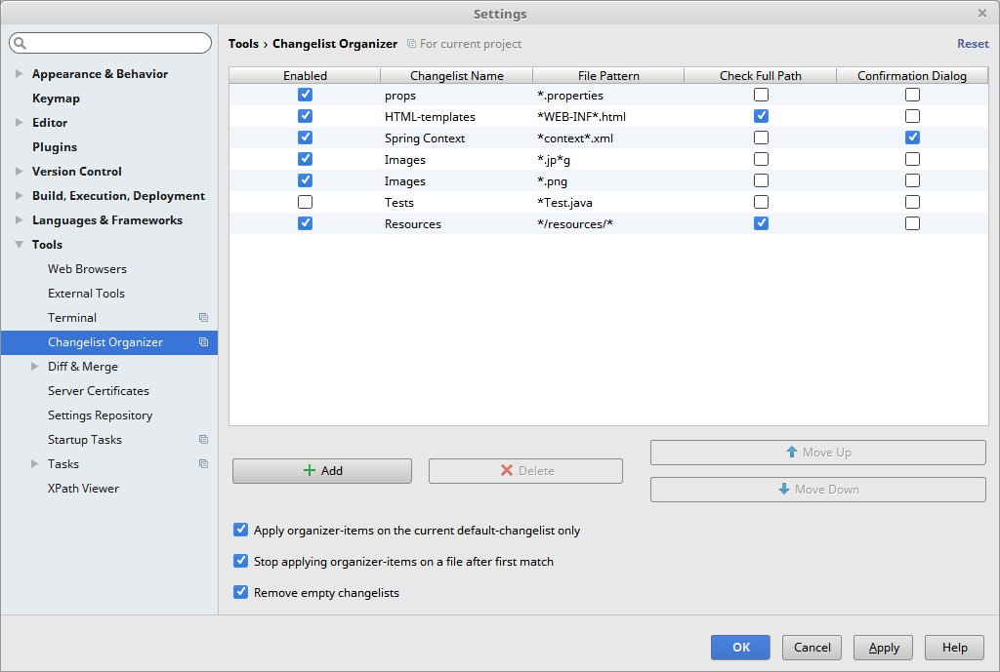
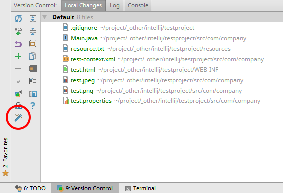
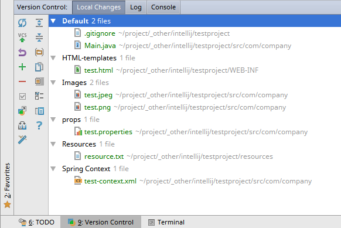

#  Changelist Organizer
> Automated Changelist Organizing for IntelliJ

## About
This IntelliJ-plugin can help you to organize your changelist with just one click.
Simply define your wanted changelists and assign files via a simple wildcard-pattern.

##  Screenshots

> 

> 

> 

## Installation

Use the IDE's built-in plugin system:

* `File` --> `Settings` --> `Plugins` --> `Marketplace`
* search for "Changelist Organizer"
* click the `Install`-button

Or go to the [plugin page](https://plugins.jetbrains.com/plugin/9216) on the JetBrains-website, download the archive-file and install manually.

## License
Please read the [license](LICENSE) file.
